# Extension Features Documentation

## OS-Chat-Application

| | |
|---|---|
| **Institution** | Iqra University |
| **Department** | Software Engineering |
| **Course** | Operating System Lab — Dynamic Data Structures |
| **Platform** | Fedora Linux |
| **Date** | June 2026 |

---

## Table of Contents

1. [User Authentication System](#1-user-authentication-system)
2. [Private Messaging](#2-private-messaging)
3. [Multi-Room Chat](#3-multi-room-chat)
4. [Colour-Coded Terminal UI](#4-colour-coded-terminal-ui)
5. [Thread-Safe Message Queue](#5-thread-safe-message-queue)
6. [Heartbeat / Keep-Alive Mechanism](#6-heartbeat--keep-alive-mechanism)
7. [Graceful Shutdown Handling](#7-graceful-shutdown-handling)
8. [Scalability Analysis](#8-scalability-analysis)
9. [Future Enhancements](#9-future-enhancements)

---

## 1. User Authentication System

### 1.1 Overview

The application implements a complete user authentication system that prevents unauthorised access to the chat server. Every connecting client must either **register** a new account or **login** with existing credentials before being permitted to participate in chat sessions.

### 1.2 Architecture

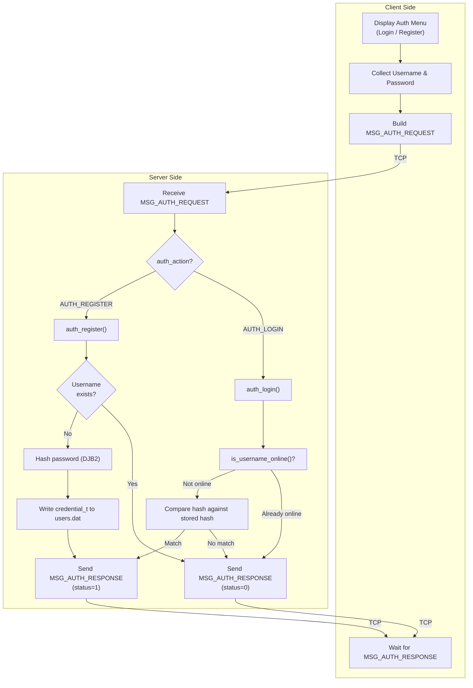

### 1.3 DJB2 Hash Function

The authentication module uses **Dan Bernstein's DJB2** hash function for password obfuscation. While not cryptographically secure, it provides sufficient protection for the laboratory context.

```c
static unsigned long djb2_hash(const char *str)
{
    unsigned long hash = 5381;
    int c;
    while ((c = *str++))
        hash = ((hash << 5) + hash) + c;   /* hash * 33 + c */
    return hash;
}
```

| Property | Value |
|----------|-------|
| **Algorithm** | DJB2 (Daniel J. Bernstein, 1991) |
| **Initial seed** | `5381` |
| **Multiplier** | `33` (implemented as `(hash << 5) + hash`) |
| **Output** | `unsigned long` (64-bit on x86-64) |
| **Storage format** | Hexadecimal string via `snprintf("%lx", ...)` |
| **Collision resistance** | Low (not designed for security) |

**Example hash computations:**

| Password | DJB2 Hash (hex) |
|----------|-----------------|
| `"password123"` | `7c9e69819e0b5` |
| `"hello"` | `210c988d2` |
| `"secret"` | `d03bd5182` |

### 1.4 File-Based Credential Storage

Credentials are stored as binary `credential_t` records in `users.dat`:

```c
typedef struct {
    char username[32];          // Null-terminated username
    char password_hash[64];     // Hex-encoded DJB2 hash
} credential_t;                 // Total: 96 bytes per record
```

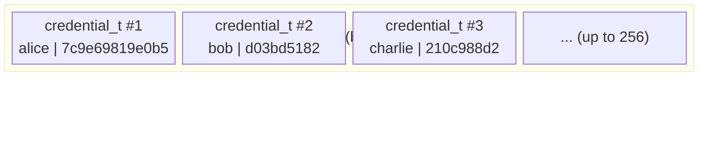

| Operation | File Mode | Function |
|-----------|-----------|----------|
| Check if user exists | `"rb"` (read binary) | `auth_register()` — scan all records |
| Store new user | `"ab"` (append binary) | `auth_register()` — append `credential_t` |
| Verify credentials | `"rb"` (read binary) | `auth_login()` — scan and compare |

### 1.5 Duplicate Session Prevention

The server prevents the same username from being logged in from multiple clients simultaneously:

```c
if (is_username_online(msg.sender)) {
    resp.status = 0;
    strncpy(resp.body, "User is already logged in from another session.",
            BUFFER_SIZE - 1);
    send_message(cl->sockfd, &resp);
    continue;
}
```

This check occurs **before** credential validation, ensuring consistent single-session semantics.

---

## 2. Private Messaging

### 2.1 Overview

The `/msg` command allows users to send direct, one-to-one messages to any other online user, regardless of which room either user is currently in. Private messages are **not** visible to other users.

### 2.2 Message Flow

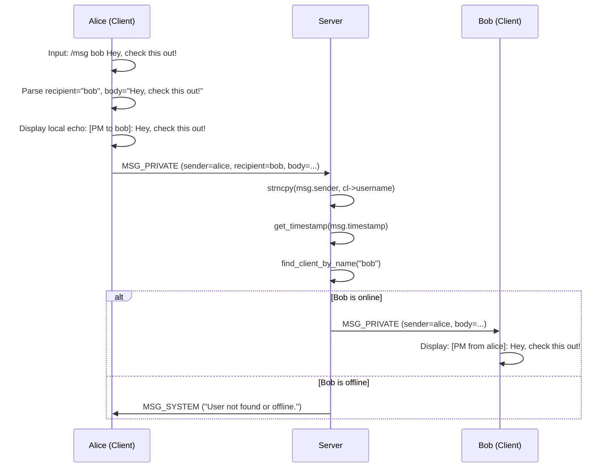

### 2.3 Client-Side Parsing

The client parses the `/msg` command by extracting the target username and remaining text:

```c
if (strncmp(input, "/msg ", 5) == 0) {
    char target[USERNAME_LEN] = "";
    const char *p = input + 5;
    while (*p == ' ') p++;           // Skip leading spaces

    int i = 0;
    while (*p && *p != ' ' && i < USERNAME_LEN - 1)
        target[i++] = *p++;          // Extract username
    target[i] = '\0';

    while (*p == ' ') p++;           // Skip space after username

    // Build and send MSG_PRIVATE with target and body
}
```

### 2.4 Server-Side Routing

The server performs a **mutex-protected lookup** to find the target client:

```c
static void handle_private_msg(client_t *sender, const message_t *msg)
{
    pthread_mutex_lock(&clients_mutex);
    client_t *target = find_client_by_name(msg->recipient);
    if (target) {
        send_message(target->sockfd, msg);
        pthread_mutex_unlock(&clients_mutex);
    } else {
        pthread_mutex_unlock(&clients_mutex);
        send_system_msg(sender->sockfd, "User not found or offline.");
    }
}
```

> [!NOTE]
> The mutex is held during the entire lookup-and-send operation to prevent the target from disconnecting between the lookup and the `send_message()` call.

---

## 3. Multi-Room Chat

### 3.1 Overview

The application supports multiple concurrent chat rooms, enabling users to organise conversations by topic. Each room functions as an independent message namespace — broadcast messages are delivered only to users within the same room.

### 3.2 Room Data Structure

```c
typedef struct {
    char    name[ROOM_NAME_LEN];   // 32-byte room name
    int     active;                // 1 = exists, 0 = free slot
    int     user_count;            // Current occupancy
} room_t;

static room_t rooms[MAX_ROOMS];   // 16 room slots (static array)
```

### 3.3 Room Operations

| Operation | Command | Server Function | Behaviour |
|-----------|---------|-----------------|-----------|
| **Create** | `/create <room>` | `create_room()` | Finds free slot in `rooms[]`, initialises name & count |
| **Join** | `/join <room>` | `handle_join_room()` | Leaves current room, auto-creates if needed, joins new room |
| **List** | `/rooms` | `handle_list_rooms()` | Iterates `rooms[]`, formats active rooms with user counts |
| **Default** | _(automatic)_ | `main()` | `"general"` room created at startup; all users placed there |

### 3.4 Room Switching Sequence

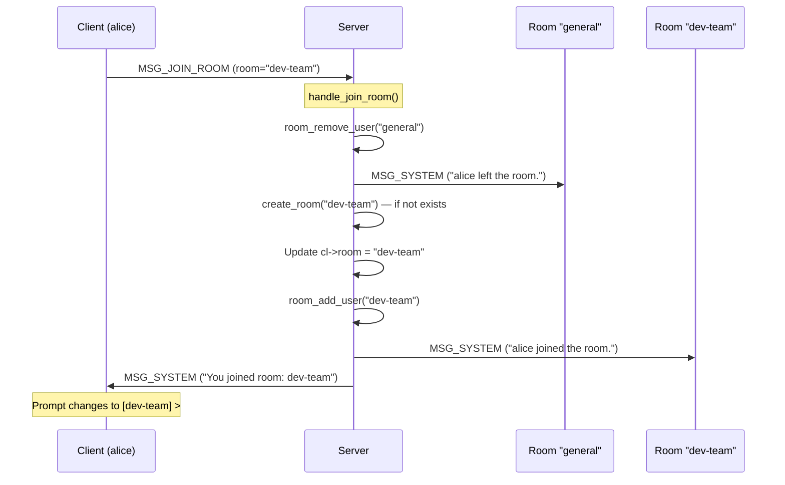

### 3.5 Room Isolation

Messages are routed based on the sender's current room:

```c
static void broadcast_to_room(const message_t *msg, int exclude_fd)
{
    pthread_mutex_lock(&clients_mutex);
    for (int i = 0; i < MAX_CLIENTS; i++) {
        if (clients[i] && clients[i]->active &&
            clients[i]->sockfd != exclude_fd &&
            strcmp(clients[i]->room, msg->room) == 0) {  // ← Room filter
            send_message(clients[i]->sockfd, msg);
        }
    }
    pthread_mutex_unlock(&clients_mutex);
}
```

### 3.6 Configuration Limits

| Parameter | Constant | Default | Location |
|-----------|----------|---------|----------|
| Max rooms | `MAX_ROOMS` | 16 | `common.h` |
| Room name length | `ROOM_NAME_LEN` | 32 characters | `common.h` |
| Default room | `DEFAULT_ROOM` | `"general"` | `common.h` |

---

## 4. Colour-Coded Terminal UI

### 4.1 Overview

The client application uses **ANSI escape codes** to render colour-coded output, allowing users to visually distinguish between different message types at a glance. This significantly improves readability in a busy multi-user chat environment.

### 4.2 ANSI Colour Code Definitions

```c
#define CLR_RESET   "\033[0m"     // Reset to default
#define CLR_RED     "\033[1;31m"  // Bold Red
#define CLR_GREEN   "\033[1;32m"  // Bold Green
#define CLR_YELLOW  "\033[1;33m"  // Bold Yellow
#define CLR_BLUE    "\033[1;34m"  // Bold Blue
#define CLR_MAGENTA "\033[1;35m"  // Bold Magenta
#define CLR_CYAN    "\033[1;36m"  // Bold Cyan
#define CLR_WHITE   "\033[1;37m"  // Bold White
#define CLR_GRAY    "\033[0;90m"  // Normal Grey
#define CLR_BOLD    "\033[1m"     // Bold (no colour change)
```

### 4.3 Colour Mapping

| Message Type | Colour(s) Applied | Visual Purpose |
|-------------|-------------------|----------------|
| **Timestamp** | Grey (`\033[0;90m`) | De-emphasise metadata |
| **Broadcast sender (others)** | Bold Blue (`\033[1;34m`) | Identify speaker |
| **Broadcast sender (self)** | Bold Green (`\033[1;32m`) | Distinguish own messages |
| **Private message tag** | Magenta (`\033[1;35m`) | Highlight DM origin/target |
| **System notification** | Yellow (`\033[1;33m`) | Draw attention to events |
| **User list border** | Cyan (`\033[1;36m`) | Visual grouping |
| **Room list border** | Green (`\033[1;32m`) | Visual grouping |
| **Auth success (✓)** | Green (`\033[1;32m`) | Positive feedback |
| **Auth failure (✗)** | Red (`\033[1;31m`) | Negative feedback |
| **Error messages** | Red (`\033[1;31m`) | Alert user to problems |
| **Room prompt `[room] >`** | Cyan (`\033[1;36m`) | Context indicator |

### 4.4 Display Rendering

The `display_message()` function handles all message rendering with proper cursor management:

```c
static void display_message(const message_t *msg)
{
    clear_input_line();  // \r\033[K — clear current line

    switch (msg->type) {
    case MSG_BROADCAST:
        printf(CLR_GRAY "%s " CLR_BOLD CLR_BLUE "%s" CLR_RESET ": %s\n",
               msg->timestamp, msg->sender, msg->body);
        break;
    case MSG_PRIVATE:
        printf(CLR_GRAY "%s " CLR_MAGENTA "[PM from %s]" CLR_RESET ": %s\n",
               msg->timestamp, msg->sender, msg->body);
        break;
    case MSG_SYSTEM:
        printf(CLR_GRAY "%s " CLR_YELLOW "*** %s ***" CLR_RESET "\n",
               msg->timestamp, msg->body);
        break;
    // ... additional cases for user list, room list, auth responses
    }

    print_prompt();  // Redisplay [room] > prompt
}
```

### 4.5 Input Line Management

Because the receive thread can print messages at any time (interrupting user input), the client uses cursor control:

```c
static void clear_input_line(void)
{
    printf("\r\033[K");   // \r = carriage return, \033[K = clear to end of line
}
```

This ensures that incoming messages are cleanly rendered above the user's current input line.

---

## 5. Thread-Safe Message Queue

### 5.1 Overview

The `msg_queue_t` structure implements a **thread-safe circular buffer** (ring buffer) following the classic **producer-consumer** concurrency pattern. It is used to queue broadcast messages for logging and asynchronous processing.

### 5.2 Circular Buffer Visualisation

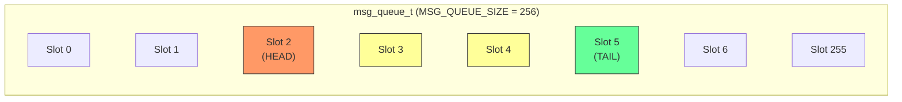

> Legend: 🟧 HEAD (next to dequeue) · 🟨 Occupied slots · 🟩 TAIL (next write position)

### 5.3 Queue Operations

#### Initialisation

```c
static void queue_init(msg_queue_t *q)
{
    memset(q, 0, sizeof(msg_queue_t));
    pthread_mutex_init(&q->mutex, NULL);
    pthread_cond_init(&q->cond, NULL);
}
```

#### Push (Enqueue) with Overflow Handling

```c
static void queue_push(msg_queue_t *q, const message_t *msg)
{
    pthread_mutex_lock(&q->mutex);

    q->messages[q->tail] = *msg;                      // Copy message into slot
    q->tail = (q->tail + 1) % MSG_QUEUE_SIZE;         // Advance tail (wrap)

    if (q->count == MSG_QUEUE_SIZE)
        q->head = (q->head + 1) % MSG_QUEUE_SIZE;     // Overwrite oldest
    else
        q->count++;

    pthread_cond_signal(&q->cond);                    // Wake consumer
    pthread_mutex_unlock(&q->mutex);
}
```

#### Destruction

```c
static void queue_destroy(msg_queue_t *q)
{
    pthread_mutex_destroy(&q->mutex);
    pthread_cond_destroy(&q->cond);
}
```

### 5.4 Concurrency Properties

| Property | Implementation |
|----------|---------------|
| **Mutual exclusion** | `pthread_mutex_lock()` / `pthread_mutex_unlock()` around all queue access |
| **Signalling** | `pthread_cond_signal()` after each push, enabling consumer wake-up |
| **Overflow policy** | Oldest message silently overwritten when queue is full (bounded buffer) |
| **Memory model** | Copy semantics (`q->messages[q->tail] = *msg`) — no shared pointers |
| **Deadlock freedom** | Single mutex; no nested locking |

### 5.5 Producer-Consumer Pattern

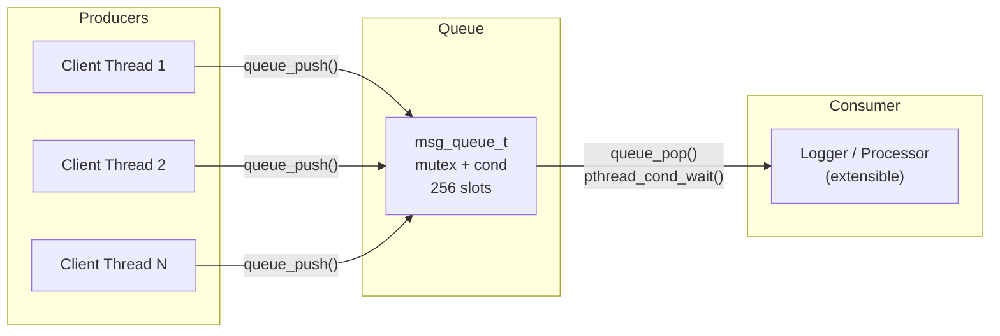

---

## 6. Heartbeat / Keep-Alive Mechanism

### 6.1 Overview

The application includes a **heartbeat (ping/pong) mechanism** to detect stale connections and maintain TCP keep-alive awareness. When the server receives a `MSG_HEARTBEAT` message, it immediately echoes it back to the sender.

### 6.2 Implementation

**Server handler (echo-back):**

```c
case MSG_HEARTBEAT:
    send_message(cl->sockfd, &msg);   /* Pong — echo the heartbeat back */
    break;
```

### 6.3 Heartbeat Sequence

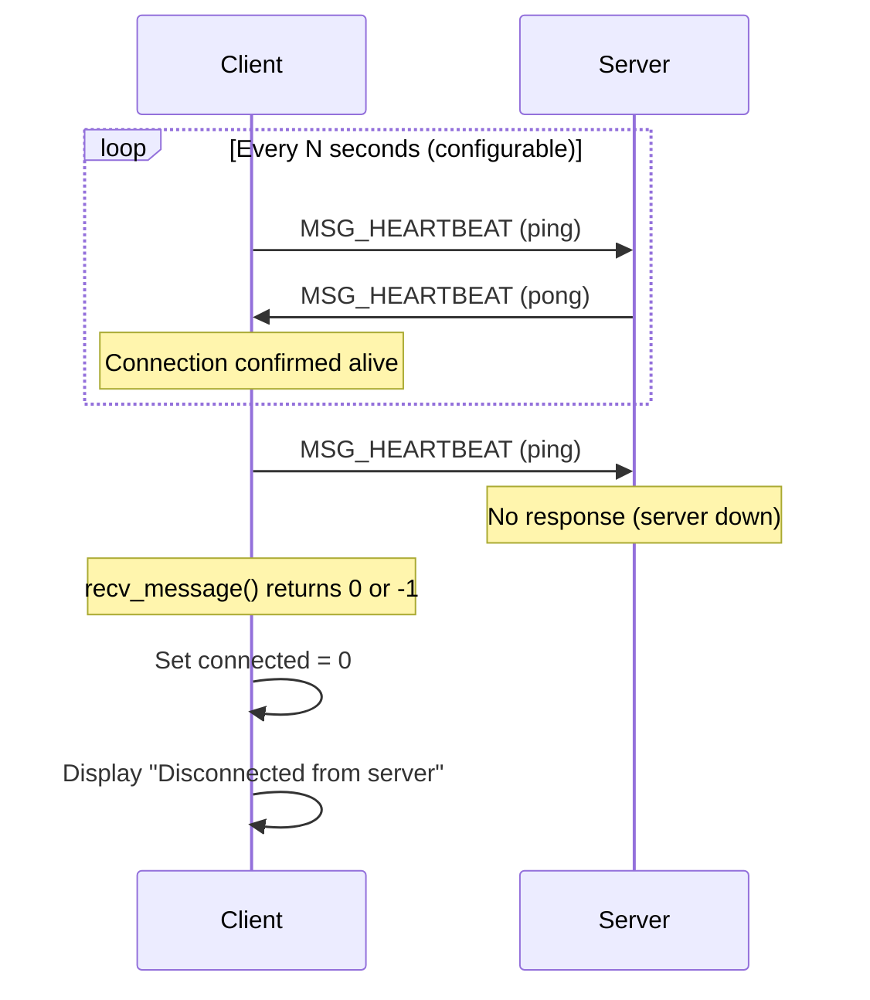

### 6.4 Design Rationale

| Aspect | Detail |
|--------|--------|
| **Purpose** | Detect half-open TCP connections where one side has crashed without sending FIN |
| **Direction** | Client → Server → Client (request-response) |
| **Protocol** | Reuses the existing `message_t` structure with `type = MSG_HEARTBEAT` |
| **Interval** | Configurable by client implementation; the server is stateless (echo-only) |
| **Failure detection** | Client-side: `recv_message()` returning ≤ 0 triggers disconnect handling |

---

## 7. Graceful Shutdown Handling

### 7.1 Overview

Both the server and client implement **signal handlers** that intercept `SIGINT` (Ctrl+C) and `SIGTERM` to perform an orderly shutdown, ensuring all resources are properly released and connected peers are notified.

### 7.2 Server Shutdown Sequence

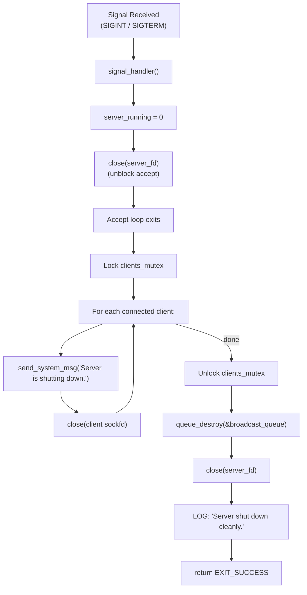

**Server signal handler:**

```c
static void signal_handler(int sig)
{
    (void)sig;
    LOG_WARN("Shutting down server...");
    server_running = 0;             // Break the accept() loop
    if (server_fd != -1)
        close(server_fd);           // Unblock accept() with EBADF
}
```

**Server shutdown code in `main()`:**

```c
/* Notify all clients and close sockets */
pthread_mutex_lock(&clients_mutex);
for (int i = 0; i < MAX_CLIENTS; i++) {
    if (clients[i]) {
        send_system_msg(clients[i]->sockfd, "Server is shutting down.");
        close(clients[i]->sockfd);
    }
}
pthread_mutex_unlock(&clients_mutex);

queue_destroy(&broadcast_queue);
close(server_fd);
```

### 7.3 Client Shutdown Sequence

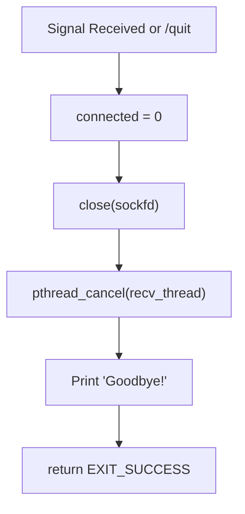

### 7.4 Signal Disposition Table

| Signal | Server Behaviour | Client Behaviour |
|--------|-----------------|-----------------|
| `SIGINT` (Ctrl+C) | Graceful shutdown: notify clients, cleanup, exit | Set `connected = 0`, close socket, exit |
| `SIGTERM` | Same as `SIGINT` | Same as `SIGINT` |
| `SIGPIPE` | `SIG_IGN` — ignored; `send()` returns `EPIPE` | `SIG_IGN` — ignored; `send()` returns `EPIPE` |

### 7.5 Resource Cleanup Checklist

| Resource | Server Cleanup | Client Cleanup |
|----------|---------------|----------------|
| Listening socket | `close(server_fd)` in signal handler + `main()` | N/A |
| Client sockets | `close()` in shutdown loop + per-thread cleanup | `close(sockfd)` in `main()` |
| `client_t` memory | `free(cl)` in each `client_handler()` thread | N/A (no dynamic allocation) |
| Mutex/Cond vars | `queue_destroy()` | N/A |
| Receive thread | Detached threads self-terminate | `pthread_cancel(recv_thread)` |
| `users.dat` | Closed after each `fread`/`fwrite` (no persistent handle) | N/A |

---

## 8. Scalability Analysis

### 8.1 Current Architecture Constraints

| Dimension | Current Limit | Bottleneck |
|-----------|---------------|------------|
| Max clients | 64 (`MAX_CLIENTS`) | Static array size; thread-per-client overhead |
| Max rooms | 16 (`MAX_ROOMS`) | Static array size |
| Max users in DB | 256 (`MAX_USERS_DB`) | Linear scan of `users.dat` |
| Message queue | 256 slots (`MSG_QUEUE_SIZE`) | Fixed ring buffer; overflow drops oldest |
| Thread count | 1 main + 64 client | OS thread limit; stack memory |

### 8.2 Scaling Analysis by Component

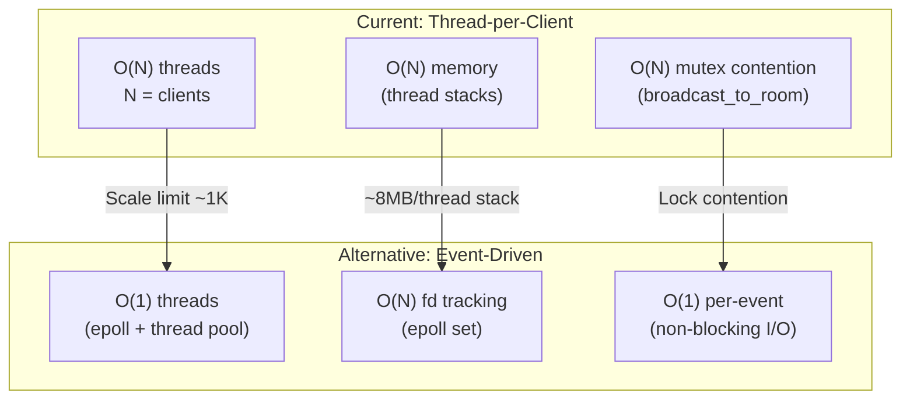

### 8.3 Scalability Recommendations

| Current Approach | Limitation | Scalable Alternative |
|-----------------|------------|---------------------|
| Thread-per-client | ~1,000 threads practical limit | `epoll()` event loop + thread pool |
| Linear room scan | O(N) per room operation | Hash map (`room_name → room_t*`) |
| Linear user scan in `users.dat` | O(N) per login attempt | SQLite database with indexed username column |
| Global `clients_mutex` | Contention under high concurrency | Per-room mutexes or read-write locks |
| Fixed-size `message_t` PDU (~2 KB) | Bandwidth inefficient for short messages | Variable-length serialisation (Protocol Buffers, MessagePack) |

---

## 9. Future Enhancements

### 9.1 Encryption (TLS/SSL)

| Aspect | Current | Enhancement |
|--------|---------|-------------|
| Transport security | Plaintext TCP | TLS 1.3 via OpenSSL / GnuTLS |
| Password hashing | DJB2 (non-cryptographic) | Argon2id with per-user salt |
| Key exchange | None | Diffie-Hellman (via TLS) |

**Implementation sketch:**

```c
// Server: wrap accepted socket with SSL
SSL_CTX *ctx = SSL_CTX_new(TLS_server_method());
SSL_CTX_use_certificate_file(ctx, "cert.pem", SSL_FILETYPE_PEM);
SSL_CTX_use_PrivateKey_file(ctx, "key.pem", SSL_FILETYPE_PEM);

SSL *ssl = SSL_new(ctx);
SSL_set_fd(ssl, client_fd);
SSL_accept(ssl);

// Replace send()/recv() with SSL_write()/SSL_read()
```

### 9.2 Graphical User Interface (GUI) Client

| Framework | Language | Pros | Cons |
|-----------|----------|------|------|
| GTK 4 | C | Native Linux, matches server language | Steep learning curve |
| Qt 6 | C++ | Cross-platform, rich widgets | Requires C++ migration |
| Electron | JavaScript | Modern UI, web technologies | Heavy memory footprint |
| ncurses | C | Terminal-based, lightweight | Limited visual capability |

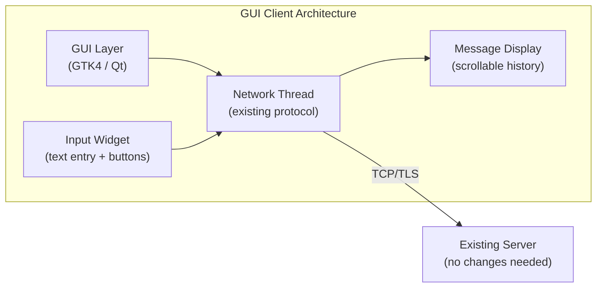

### 9.3 Database Backend

Replace `users.dat` with a relational database for persistent storage:

| Feature | File-Based (Current) | SQLite Enhancement | PostgreSQL Enhancement |
|---------|---------------------|-------------------|----------------------|
| Query speed | O(N) linear scan | O(log N) indexed | O(log N) indexed |
| Concurrent access | Single-writer | WAL mode (multi-reader) | Full MVCC |
| Message history | Not persisted | Stored with timestamps | Stored with full-text search |
| User profiles | Username + hash only | Extended fields | Relational schema |
| Scalability | ~256 users | ~100,000 users | Millions of users |

**Proposed schema:**

```sql
CREATE TABLE users (
    id          INTEGER PRIMARY KEY AUTOINCREMENT,
    username    TEXT UNIQUE NOT NULL,
    pass_hash   TEXT NOT NULL,
    created_at  TIMESTAMP DEFAULT CURRENT_TIMESTAMP
);

CREATE TABLE messages (
    id          INTEGER PRIMARY KEY AUTOINCREMENT,
    sender_id   INTEGER REFERENCES users(id),
    room        TEXT NOT NULL,
    body        TEXT NOT NULL,
    msg_type    INTEGER NOT NULL,
    created_at  TIMESTAMP DEFAULT CURRENT_TIMESTAMP
);

CREATE TABLE rooms (
    id          INTEGER PRIMARY KEY AUTOINCREMENT,
    name        TEXT UNIQUE NOT NULL,
    created_by  INTEGER REFERENCES users(id),
    created_at  TIMESTAMP DEFAULT CURRENT_TIMESTAMP
);
```

### 9.4 File Transfer

Enable peer-to-peer or server-relayed file transfers:

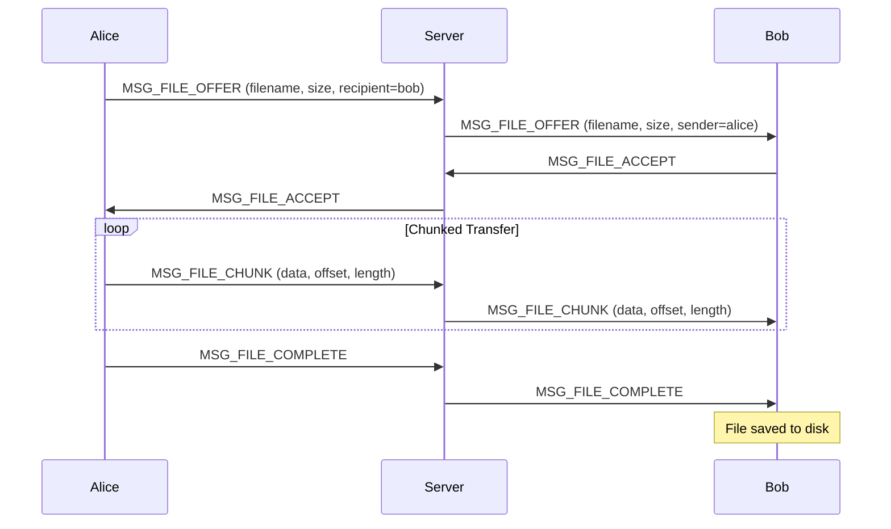

### 9.5 Additional Future Features

| Feature | Description | Complexity |
|---------|-------------|------------|
| **Message history** | Persist messages to database; load on room join | Medium |
| **User profiles** | Display name, status message, join date | Low |
| **Admin commands** | `/kick`, `/ban`, `/mute` with privilege levels | Medium |
| **Typing indicators** | `MSG_TYPING` notification broadcast to room | Low |
| **Read receipts** | Track message delivery and read status | Medium |
| **Rate limiting** | Prevent message flooding (token bucket algorithm) | Medium |
| **Chat bots** | Automated responder / moderator framework | High |
| **End-to-end encryption** | Client-side key exchange (Signal Protocol) | High |
| **Load balancing** | Multiple server instances with shared state (Redis) | High |
| **Mobile client** | Android/iOS client using same TCP protocol | High |

---

> [!TIP]
> The modular design of the application — with clean separation between authentication (`auth.h`), protocol definitions (`common.h`), server logic (`server.c`), and client logic (`client.c`) — facilitates incremental implementation of these enhancements without requiring architectural rework.
