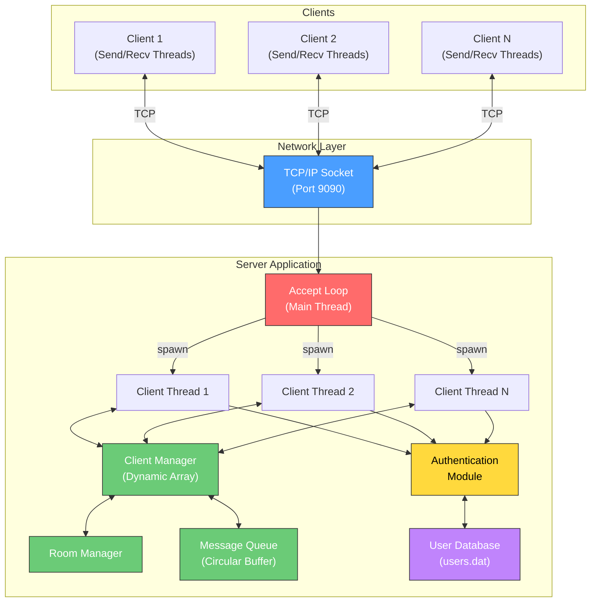
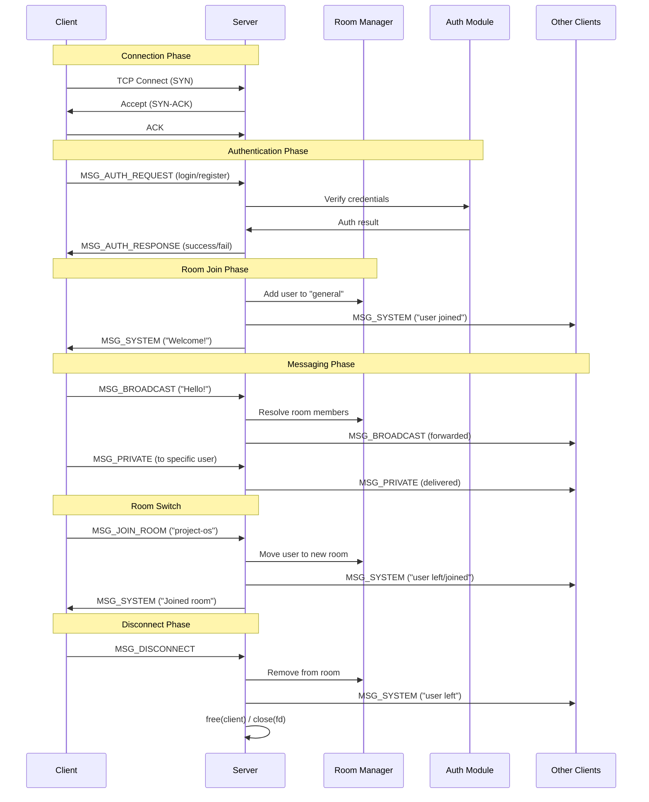
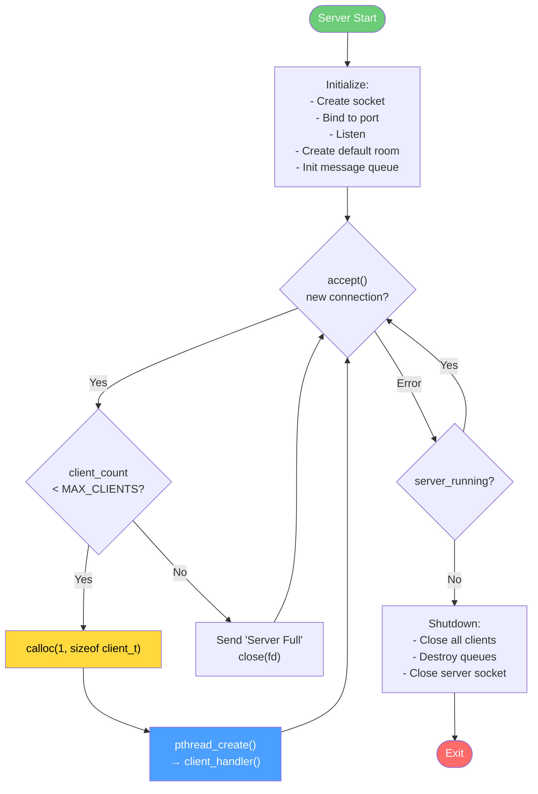
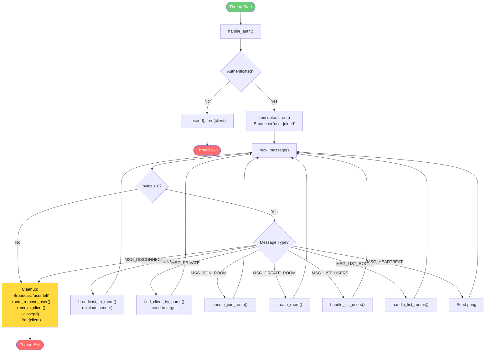
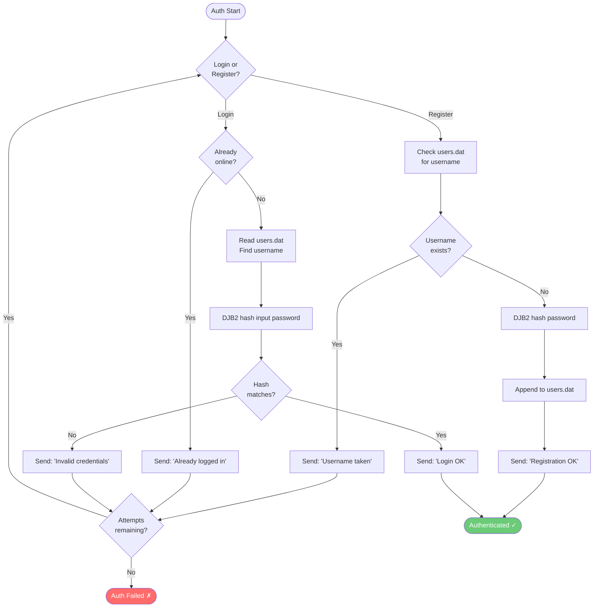
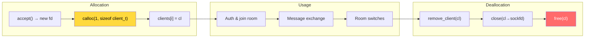
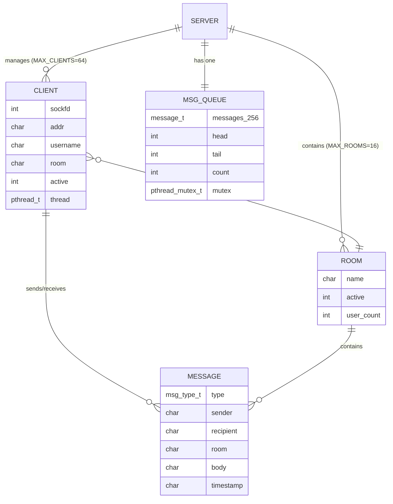

# OS-Chat-Application - Flowcharts & Block Diagrams

> Operating System Lab | Iqra University | Department of Software Engineering

---

## 1. System Block Diagram

## 2. Client-Server Communication Sequence

## 3. Server Main Loop Flowchart

## 4. Client Handler Thread Flowchart

## 5. Authentication Flow

## 6. Memory Management Lifecycle

## 7. Data Structure Relationships

---

*Generated for Operating System Lab — Iqra University*
