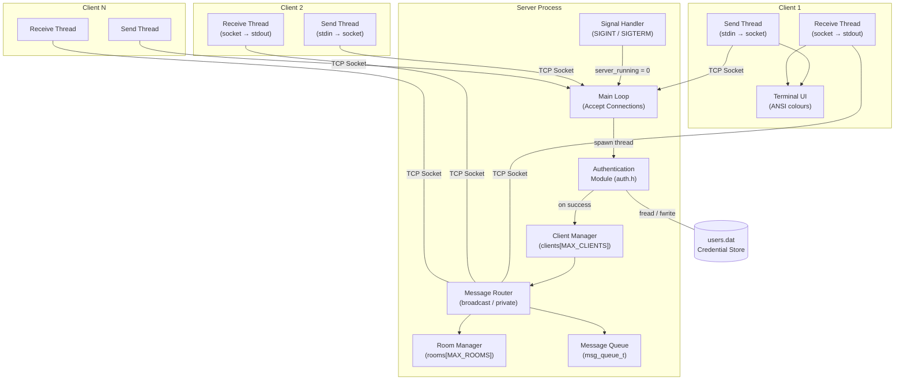
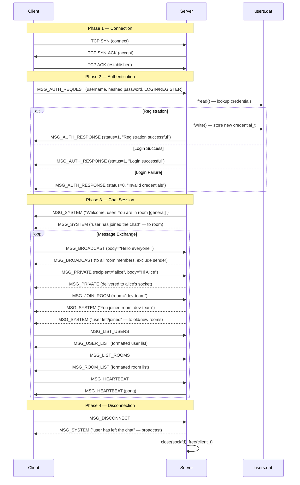
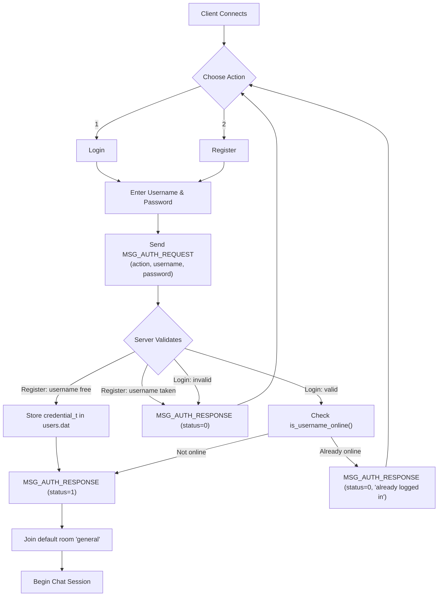
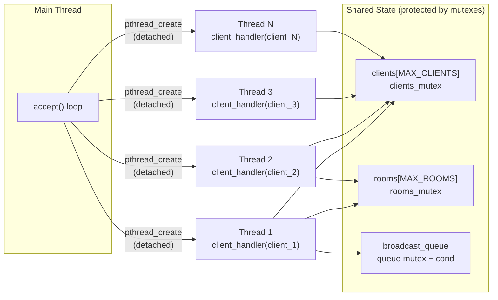
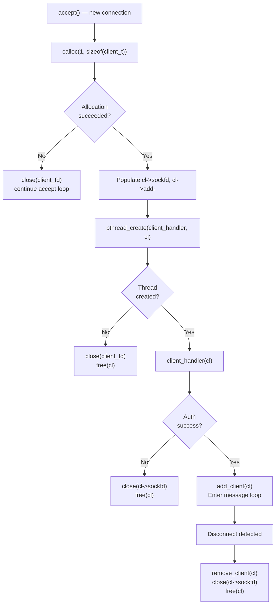
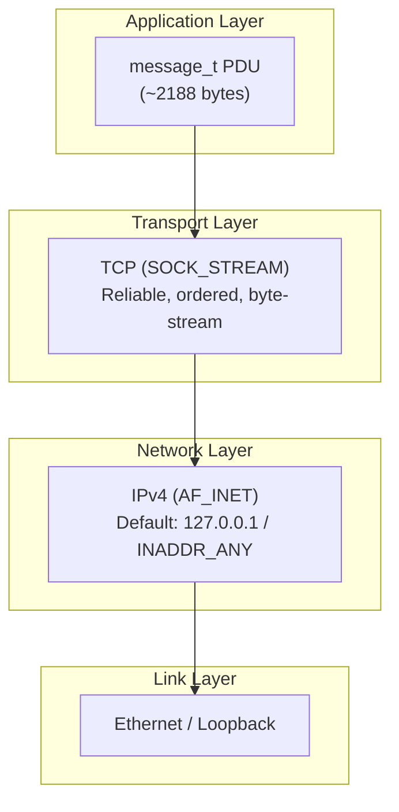

# System Design Document

## OS-Chat-Application

| | |
|---|---|
| **Institution** | Iqra University |
| **Department** | Software Engineering |
| **Course** | Operating System Lab — Dynamic Data Structures |
| **Platform** | Fedora Linux |
| **Language** | C (ISO C11) |
| **Date** | June 2026 |

---

## Table of Contents

1. [Project Overview](#1-project-overview)
2. [System Architecture](#2-system-architecture)
3. [Communication Flow](#3-communication-flow)
4. [Data Structures](#4-data-structures)
5. [Message Protocol](#5-message-protocol)
6. [Threading Model](#6-threading-model)
7. [Memory Management Strategy](#7-memory-management-strategy)
8. [Network Protocol Details](#8-network-protocol-details)
9. [Security Considerations](#9-security-considerations)
10. [File Organisation](#10-file-organisation)

---

## 1. Project Overview

### 1.1 Purpose

This project implements a **multi-threaded, real-time chat application** using the TCP/IP socket API in the C programming language. It is designed as a hands-on laboratory exercise to reinforce core operating-system concepts including process and thread management, inter-process communication, synchronisation primitives, dynamic memory allocation, and network programming.

### 1.2 Objectives

| # | Objective | OS Concept Demonstrated |
|---|-----------|------------------------|
| 1 | Establish concurrent TCP connections between a server and multiple clients | Socket programming, `accept()` loop |
| 2 | Handle each client session in an independent POSIX thread | `pthread_create`, detached threads |
| 3 | Protect shared data structures from race conditions | `pthread_mutex_t`, `pthread_cond_t` |
| 4 | Dynamically allocate and free per-client memory | `calloc()`, `free()`, lifetime management |
| 5 | Implement a circular message queue with producer-consumer semantics | Ring buffer, condition variables |
| 6 | Provide user authentication with hashed credentials | File I/O, DJB2 hash function |
| 7 | Support multi-room chat with private messaging | Routing logic, namespace management |
| 8 | Handle graceful shutdown via UNIX signal interception | `signal()`, `SIGINT`, `SIGTERM`, `SIGPIPE` |

### 1.3 Scope

The application comprises two independently compiled binaries:

- **`server`** — accepts incoming connections, authenticates users, routes messages between clients, and manages rooms.
- **`client`** — connects to the server, provides an interactive terminal interface, and renders colour-coded messages.

---

## 2. System Architecture

### 2.1 High-Level Block Diagram



### 2.2 Component Descriptions

| Component | Source Location | Responsibility |
|-----------|-----------------|----------------|
| **Main Accept Loop** | `server.c : main()` | Binds socket, listens, accepts connections, enforces capacity limits |
| **Client Handler Thread** | `server.c : client_handler()` | Per-client thread; handles auth, message dispatch, cleanup |
| **Authentication Module** | `auth.h` | Registration, login, DJB2 password hashing, file-based credential storage |
| **Room Manager** | `server.c : create_room(), room_add/remove_user()` | Creates rooms, tracks user counts, enforces `MAX_ROOMS` |
| **Client Manager** | `server.c : add_client(), remove_client()` | Maintains `clients[]` array, tracks `client_count` |
| **Message Router** | `server.c : broadcast_to_room(), broadcast_to_all(), handle_private_msg()` | Delivers messages to correct recipients |
| **Message Queue** | `server.c : msg_queue_t` | Thread-safe circular buffer for broadcast logging |
| **Signal Handler** | `server.c : signal_handler()` | Sets `server_running = 0`, triggers graceful shutdown |
| **Client UI** | `client.c : display_message(), print_prompt()` | ANSI colour rendering, command parsing |

---

## 3. Communication Flow

### 3.1 Client-Server Sequence Diagram



### 3.2 Authentication Flow Detail



---

## 4. Data Structures

### 4.1 `message_t` — Wire Protocol Message

The `message_t` structure serves as the **unified application-layer protocol data unit (PDU)** for all communication between the server and clients. It is transmitted as a fixed-size binary blob over TCP.

```c
typedef struct {
    msg_type_t    type;                     // Message category
    char          sender[USERNAME_LEN];     // Originating username
    char          recipient[USERNAME_LEN];  // Target user (private msgs)
    char          room[ROOM_NAME_LEN];      // Target room
    char          body[BUFFER_SIZE];        // Message payload
    char          timestamp[TIMESTAMP_LEN]; // ISO-8601 formatted time
    auth_action_t auth_action;              // AUTH_LOGIN or AUTH_REGISTER
    int           status;                   // 0 = failure, 1 = success
} message_t;
```

| Field | Size (bytes) | Purpose |
|-------|-------------|---------|
| `type` | 4 | Discriminator enum (`msg_type_t`) selecting handler logic |
| `sender` | 32 | Username of message originator; set to `"SERVER"` for system messages |
| `recipient` | 32 | Target username for `MSG_PRIVATE`; unused for other types |
| `room` | 32 | Room name for `MSG_BROADCAST`, `MSG_JOIN_ROOM`, `MSG_CREATE_ROOM` |
| `body` | 2048 | Free-text payload: chat text, system notification, or password (auth) |
| `timestamp` | 32 | Server-generated timestamp in `YYYY-MM-DD HH:MM:SS` format |
| `auth_action` | 4 | `AUTH_LOGIN` or `AUTH_REGISTER` (used only with `MSG_AUTH_REQUEST`) |
| `status` | 4 | Result code for `MSG_AUTH_RESPONSE`: 1 = success, 0 = failure |

> [!NOTE]
> The total size of `message_t` is approximately **2,188 bytes**. The structure is transmitted in host byte order, which is acceptable when both server and clients run on the same architecture (x86-64 Linux).

### 4.2 `client_t` — Client Session

Dynamically allocated with `calloc()` upon each `accept()`. Freed in `client_handler()` on disconnect.

```c
typedef struct {
    int             sockfd;                 // Socket file descriptor
    char            addr[INET_ADDRSTRLEN];  // Client IP (e.g. "192.168.1.5")
    char            username[USERNAME_LEN]; // Authenticated name
    char            room[ROOM_NAME_LEN];   // Current room
    int             active;                // 1 = connected, 0 = disconnected
    pthread_t       thread;                // Handling thread ID
} client_t;
```

| Field | Type | Notes |
|-------|------|-------|
| `sockfd` | `int` | Used for `send()` / `recv()` / `close()` |
| `addr` | `char[16]` | Populated via `inet_ntop()` for logging |
| `username` | `char[32]` | Set after successful authentication |
| `room` | `char[32]` | Initialised to `"general"`; updated on `/join` |
| `active` | `int` | Guard flag; prevents messaging to disconnected clients |
| `thread` | `pthread_t` | Created as **detached**; no `pthread_join()` required |

### 4.3 `room_t` — Chat Room

Statically allocated as a fixed-size array `rooms[MAX_ROOMS]` (16 slots).

```c
typedef struct {
    char    name[ROOM_NAME_LEN];   // Unique room identifier
    int     active;                // 1 = exists, 0 = free slot
    int     user_count;            // Number of users currently present
} room_t;
```

### 4.4 `msg_queue_t` — Thread-Safe Circular Message Queue

```c
typedef struct {
    message_t       messages[MSG_QUEUE_SIZE];   // Fixed ring buffer (256 slots)
    int             head;                       // Dequeue index
    int             tail;                       // Enqueue index
    int             count;                      // Current occupancy
    pthread_mutex_t mutex;                      // Mutual exclusion
    pthread_cond_t  cond;                       // Consumer signalling
} msg_queue_t;
```

The queue implements the **producer-consumer pattern**:

- **Producer**: any client handler thread calling `queue_push()`
- **Overflow policy**: when full, the oldest message at `head` is silently overwritten (ring buffer semantics)
- **Thread safety**: all operations are guarded by `mutex`, with `cond` used to signal waiting consumers

### 4.5 `credential_t` — User Credential Record

```c
typedef struct {
    char username[USERNAME_LEN];         // 32 bytes
    char password_hash[PASSWORD_LEN];    // 64 bytes (hex-encoded DJB2 hash)
} credential_t;
```

Stored sequentially in the binary file `users.dat` via `fwrite()` / `fread()`.

---

## 5. Message Protocol

### 5.1 Message Types

The `msg_type_t` enumeration defines **14 distinct message types** that form the application-layer protocol:

| Enum Value | Direction | Purpose | Key Fields Used |
|---|---|---|---|
| `MSG_AUTH_REQUEST` | Client → Server | Login or registration attempt | `sender`, `body` (password), `auth_action` |
| `MSG_AUTH_RESPONSE` | Server → Client | Authentication result | `body` (message), `status` |
| `MSG_BROADCAST` | Bidirectional | Public message to room | `sender`, `room`, `body`, `timestamp` |
| `MSG_PRIVATE` | Bidirectional | Direct message to a user | `sender`, `recipient`, `body`, `timestamp` |
| `MSG_SYSTEM` | Server → Client | System notification | `sender` ("SERVER"), `body` |
| `MSG_JOIN_ROOM` | Client → Server | Request to join a room | `room` |
| `MSG_LEAVE_ROOM` | Client → Server | Request to leave a room | `room` |
| `MSG_LIST_USERS` | Client → Server | Request online user list | _(none)_ |
| `MSG_LIST_ROOMS` | Client → Server | Request available room list | _(none)_ |
| `MSG_USER_LIST` | Server → Client | Formatted user list response | `body` |
| `MSG_ROOM_LIST` | Server → Client | Formatted room list response | `body` |
| `MSG_CREATE_ROOM` | Client → Server | Request to create a new room | `room` |
| `MSG_DISCONNECT` | Client → Server | Graceful disconnection | `sender` |
| `MSG_HEARTBEAT` | Bidirectional | Keep-alive ping/pong | _(none)_ |

### 5.2 Protocol Characteristics

| Property | Value |
|----------|-------|
| Transport | TCP (SOCK_STREAM) |
| Serialisation | Fixed-size binary struct (`sizeof(message_t)`) |
| Byte order | Host-native (no `htonl`/`ntohl` on payload) |
| Framing | Implicit via fixed struct size; `recv_message()` loops until all bytes received |
| Encryption | None (plaintext; suitable for lab environment only) |
| Compression | None |

### 5.3 Message Serialisation

```c
// Sending: single send() call with sizeof(message_t) bytes
static inline ssize_t send_message(int sockfd, const message_t *msg) {
    return send(sockfd, msg, sizeof(message_t), 0);
}

// Receiving: loop until exactly sizeof(message_t) bytes are read
static inline ssize_t recv_message(int sockfd, message_t *msg) {
    ssize_t total = 0;
    ssize_t bytes_left = sizeof(message_t);
    char *ptr = (char *)msg;
    while (bytes_left > 0) {
        ssize_t n = recv(sockfd, ptr + total, bytes_left, 0);
        if (n <= 0) return n;
        total += n;
        bytes_left -= n;
    }
    return total;
}
```

> [!IMPORTANT]
> The `recv_message()` function implements **complete-read semantics**, looping until exactly `sizeof(message_t)` bytes have been accumulated. This is essential because TCP is a byte-stream protocol and a single `recv()` call may return a partial message.

---

## 6. Threading Model

### 6.1 Server Threading Architecture



### 6.2 Thread Lifecycle

| Phase | Description |
|-------|-------------|
| **Creation** | `pthread_create()` with `PTHREAD_CREATE_DETACHED` attribute — resources are reclaimed automatically on thread exit |
| **Authentication** | Thread calls `handle_auth()` synchronously; blocks on `recv_message()` waiting for credentials |
| **Message Loop** | Thread enters `while(server_running)` loop, blocking on `recv_message()` and dispatching by `msg.type` |
| **Cleanup** | On disconnect: set `active=0`, broadcast leave message, call `room_remove_user()`, `remove_client()`, `close(sockfd)`, `free(cl)` |

### 6.3 Client Threading Architecture

| Thread | Function | Role |
|--------|----------|------|
| **Main Thread** | `main() → process_input()` | Reads stdin, parses commands, sends messages |
| **Receive Thread** | `receive_handler()` | Blocks on `recv_message()`, calls `display_message()` |

### 6.4 Synchronisation Primitives

| Primitive | Variable | Protects |
|-----------|----------|----------|
| `pthread_mutex_t` | `clients_mutex` | `clients[]` array, `client_count` |
| `pthread_mutex_t` | `rooms_mutex` | `rooms[]` array, `room_count` |
| `pthread_mutex_t` | `broadcast_queue.mutex` | Queue `head`, `tail`, `count`, `messages[]` |
| `pthread_cond_t` | `broadcast_queue.cond` | Signals new message availability to consumers |

---

## 7. Memory Management Strategy

### 7.1 Allocation Policy

| Resource | Allocation Method | Lifetime | Deallocation |
|----------|-------------------|----------|--------------|
| `client_t` | `calloc(1, sizeof(client_t))` | Per-connection | `free(cl)` in `client_handler()` on disconnect |
| `rooms[]` | Static array `room_t rooms[MAX_ROOMS]` | Application lifetime | Implicit (stack/BSS) |
| `clients[]` | Static pointer array `client_t *clients[MAX_CLIENTS]` | Application lifetime | Pointers nulled; pointees freed individually |
| `broadcast_queue` | Static `msg_queue_t` | Application lifetime | `queue_destroy()` on shutdown |
| `message_t` | Stack-allocated (local variables) | Per-function-call | Automatic |

### 7.2 Dynamic Allocation Diagram



### 7.3 Leak Prevention Strategies

1. **Single-owner principle**: each `client_t*` is owned by exactly one `client_handler` thread, which is solely responsible for freeing it.
2. **Early-exit cleanup**: if `pthread_create()` or authentication fails, the allocated `client_t` is immediately freed before the function returns.
3. **`calloc()` over `malloc()`**: zero-initialisation prevents use of uninitialised fields.
4. **`queue_destroy()`**: mutex and condition variable resources are explicitly destroyed during server shutdown.
5. **Detached threads**: `PTHREAD_CREATE_DETACHED` ensures thread resources are automatically reclaimed by the OS upon thread termination.

---

## 8. Network Protocol Details

### 8.1 TCP/IP Stack Usage



### 8.2 Socket API Call Sequence

**Server side:**

```
socket(AF_INET, SOCK_STREAM, 0)
    → setsockopt(SO_REUSEADDR)
    → bind(INADDR_ANY, port)
    → listen(MAX_CLIENTS)
    → accept()  [blocking, in loop]
        → inet_ntop()  [log client IP]
        → pthread_create(client_handler)
```

**Client side:**

```
socket(AF_INET, SOCK_STREAM, 0)
    → inet_pton(server_ip)
    → connect(server_addr)
    → authenticate()  [send/recv MSG_AUTH_*]
    → pthread_create(receive_handler)
    → main input loop: fgets() → process_input() → send_message()
```

### 8.3 Socket Options

| Option | Value | Rationale |
|--------|-------|-----------|
| `SO_REUSEADDR` | 1 | Allows immediate port rebinding after server restart (avoids `TIME_WAIT` delay) |
| `SIGPIPE` | `SIG_IGN` | Prevents server/client crash when writing to a closed socket; `send()` returns `EPIPE` instead |

### 8.4 Port Configuration

| Parameter | Default | Override |
|-----------|---------|----------|
| Server port | `9090` | `./server <port>` or `make run-server PORT=8080` |
| Client target IP | `127.0.0.1` | `./client <ip> [port]` or `make run-client SERVER_IP=x.x.x.x` |
| Client target port | `9090` | `./client [ip] <port>` |

---

## 9. Security Considerations

> [!WARNING]
> This application is designed for **educational use** in a controlled laboratory environment. It does **not** implement production-grade security measures.

| Aspect | Current Implementation | Production Improvement |
|--------|----------------------|----------------------|
| Password storage | DJB2 hash (non-cryptographic) | bcrypt / Argon2 with salt |
| Transport | Plaintext TCP | TLS 1.3 (OpenSSL / GnuTLS) |
| Authentication | 3-attempt limit, no lockout | Rate limiting, account lockout, CAPTCHA |
| Session management | Single-session enforcement | Token-based sessions with expiry |
| Input validation | `strncpy` with bounds | Comprehensive sanitisation, length checks |
| File permissions | Default `umask` | Restrict `users.dat` to `0600` |

---

## 10. File Organisation

```
OS-Chat-Application/
├── Makefile               # Build system with server, client, valgrind targets
├── docs/
│   ├── system_design.md          # This document
│   ├── testing_documentation.md  # Test plan and results
│   ├── user_guide.md             # End-user guide
│   └── extension_features.md     # Extended feature documentation
└── src/
    ├── common.h           # Shared constants, message_t, utility functions
    ├── auth.h             # Authentication module (DJB2, file I/O)
    ├── server.c           # Multi-threaded TCP chat server (767 lines)
    └── client.c           # Interactive terminal chat client (483 lines)
```

| File | Lines | Purpose |
|------|-------|---------|
| `common.h` | 162 | Configuration constants, `message_t` struct, ANSI colour macros, `send_message()` / `recv_message()` |
| `auth.h` | 120 | `credential_t`, `djb2_hash()`, `auth_register()`, `auth_login()` |
| `server.c` | 767 | Server main, client/room management, message routing, signal handling |
| `client.c` | 483 | Client main, authentication UI, command parser, receive thread, display |
| `Makefile` | 114 | Build rules, run targets, Valgrind integration, help |

---

> [!TIP]
> For compilation and usage instructions, refer to the [User Guide](user_guide.md). For details on extended features such as private messaging, multi-room chat, and the colour-coded UI, see the [Extension Features](extension_features.md) document.
